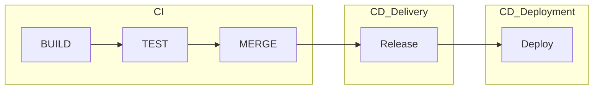

## 용어 정리
- 컴파일 : 프로그래머가 작성한 소스코드를 기계어로 변환하는 과정
- 빌드 : 소스 코드 파일을 컴퓨터에서 실행 할 수 있는 소프트웨어 산출물로 만드는 과정
- 배포: 빌드의 결과물을 사용자가 접근할 수 있는 환경에 배치 하는 것


## CI/CD란?

### DevOps의 등장
소프트웨어 개발(Dev)와 소프트웨어 운영(Ops)을 통합하는 단어로, 빠른 개발 사이클과 지속적 배포를 가능하게 하기 위한 움직임으로 시작되었다.

### 파이프라인(Pipeline)


### CI (Continuous Integration)

**지속적 통합**이라는 뜻으로 개발을 진행하면서도 품질을 관리 할 수 있도록 *여러명이 하나의 코드에 대해서 수정을 진행 해도 지속적으로 통합하면서 관리할 수 있는 것*을 의미한다.

- 코드변경사항을 주기적으로 빈번하게 merge해야한다.
- 통합을 위한 단계(build, test, merge)의 자동화
- 테스트 코드를 통과하지 못하면 merge가 안된다.

#### 장점
- 문제점을 빠르게 발견할 수 있다.
- merge충돌을 피할 수 있다
- 버그수정이 용이하다
- 생산성이 향상된다.


### CD (Continuous Delivery & Deployment)
**지속적 배포**라는 뜻으로 *빌드의 결과물을 프로덕션으로 릴리스 하는 작업을 자동화 하는 것*을 의미한다. CI 이후 Staging(Release) 하는 단계까지 자동화 되어있다면 Continuous Delivery 이고, Deploy 단계까지 자동화가 되었다면 Continuous Deployment 이다.

### CI/CD 툴
```Jenkins, Github Actions, Travis CI``` 등이 있음

> ```Docker, Kubernetes``` 등은 아닌가?  
엄밀하게는 CI/CD 툴이 아니지만 CI/CD 워크플로우이다.
{: .prompt-tip}

## 내가 하고싶은 CI/CD


이 블로그를 ```gitHub Actions```로 관리중인데, ```Jenkins - docker - kubernetes```로 배포하는 방법을 알고싶다.

## CI/CD는 왜 필요한가?
여러명의 개발자가 동시에 개발함에 있어서 자신의 코드를 합치게 되는데, 문제가 있는 코드를 합치고 이 사실을 몰랐다면, 버그를 발생한 시점에 그 이후에 합쳐진 모든 코드를 다 봐야하므로 생산성이 매우 떨어진다.


## 자동화된 테스트?
개인적으로 이러한 도구들을 보면서 **자동화된 테스트도구가 올바르지 않으면 체계에 많은 문제가 되겠다**고 생각했다. 올바른 자동화 테스트는 무엇이며, 테스트코드에 관련된 내용도 꼭 알아봐야 겠다.

## Reference

- CI/CD 5분 개념정리: [https://www.youtube.com/watch?v=g6Tg6_qpIVc](https://www.youtube.com/watch?v=0Emq5FypiMM)
- [10분 테코톡] 찬, 레넌의 CI/CD와 무중단 배포: [https://www.youtube.com/watch?v=sIPU_VkrguI](https://www.youtube.com/watch?v=sIPU_VkrguI)
- [웨비나] 클라우드 상에서의 효율적인 CI, CD사용방법[https://www.youtube.com/watch?v=C6hyW2QOGmU](https://www.youtube.com/watch?v=C6hyW2QOGmU)
