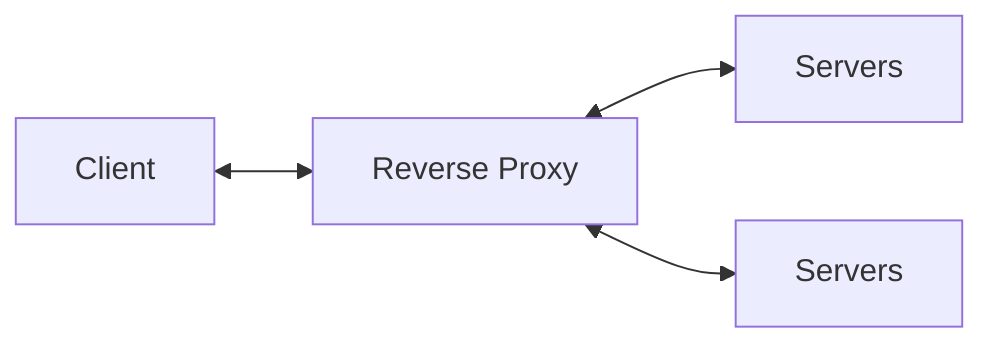

## 무중단 배포

### Downtime (다운타임)?

수정이나 재배포를 위해 기존의 서비스를 종료하고 새로운 서비스를 시작하는데 걸리는 시간을 의미한다.

### 무중단 배포를 구현하는 방법
- AWS에서 Blue-Green 무중단 배포
- Docker를 이용한 무중단 배포
- L4, L7 스위치를 이용한 무중단 배포
- Nginx를 이용한 무중단 배포

 
## 용어정리

### Reverse Proxy (리버스 프록시)
- 인터넷과 서버사이에 위치한 중계서버
- 클라이언트가 요청한 내용을 캐싱
- 서버 정보를 클라이언트로 부터 숨길 수 있어 보안에 용이하다.

### Load Balancing (로드 밸런싱)
- 부하 분산
- 서버에 가해지는 부하를 분산해주는 역할
- 하나의 서버가 멈추더라도 서비스 중단없이 다른 서버가 서비스를 계속 유지할 수 있는 무중단 배포가 가능

 
## 무중단 배포 방식

### Rolling 배포
>- *무중단 배포의 가장 기본적인 방식*
- *서버를 차례대로 업데이트 시키는 방식*

장점
- 인스턴스를 추가하지 않아도 돼서 관리가 간편

단점
- 사용중인 인스턴스에 트래픽이 몰릴 수 있음
- 구버전과 신버전의 공존으로 인한 호환성 문제

### Canary 배포
>- *옛날 광부들이 유독가스에 민감한 카나리아새를 이용해 가스 누출 위험을 감지 했던 것에서 유래*
- *신버전을 소수의 사용자들에게만 배포*
- *문제가 없는 것이 확인되면 점진적으로 다른 서버에 신버전 배포*

장점
- 문제상황을 빠르게 감지 가능
- A/B 테스트로 활용 가능

단점
- 모니터링 관리 비용
- 구버전과 신버전의 공존으로 인한 호환성 문제

### Blue/ Green 배포
>- *Blue를 구버전, Green을 신버전으로 지칭*
- *구버전과 동일하게 신버전의 인스턴스를 구성*
- *신버전 배포시 로드밸런서를 통해 신버전으로만 트래픽을 전환*

장점
- 배포하는 속도가 빠르다
- 신속하게 롤백 가능
- 남아있는 기존버전의 환경을 다음 배포에 재사용

단점
- 시스템 자원이 2배로 필요

 
## Reference
- CI/CD(Continuous Integration/Continuous Delivery)란?[https://www.redhat.com/ko/topics/devops/what-is-ci-cd](https://www.redhat.com/ko/topics/devops/what-is-ci-cd)
- [10분 테코톡] 찬, 레넌의 CI/CD와 무중단 배포[https://www.youtube.com/watch?v=sIPU_VkrguI](https://www.youtube.com/watch?v=sIPU_VkrguI)

