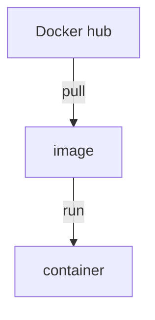
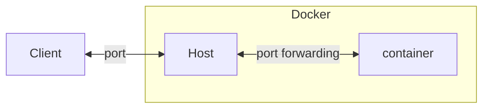

---
title : Docker?
date : 2023-03-21 00:00:00 +09:00
categories : [CI/CD, Docker]
tags : [study, ci, cd, docker] 
mermaid: true
---

## Docker
Docker는 하나의 Host안에 여러개의 Container를 가지고 있는 구조로 되어있다.

### Container (컨테이너)
기존 웹서버와 데이터베이스에 각각 OS를 설치하여 가상머신을 사용하던 방식에서 웹서버와 데이터베이스를 컨테이너로 격리하여 별도의 설치없이 사용할 수 있게 함

### Linux 
Docker는 기반이 Linux이기 때문에 다른 OS를 사용하게 되면 가상머신을 설치하고 Linux OS를 자동으로 설치해서 사용하게되어 약간의 성능 저하가 있다.

>Linux의 문법이나 구조에 대해서도 알아봐야 겠다.
{:.prompt-tip}

<br>

## 설치
> *Docker* : [설치](https://www.docker.com/)
{:.prompt-info}
각 OS별로 설치 요건이 다르다. 필자는 Windows를 사용하기 때문에 Windows기준으로 설치를 하였다.

설치를 완료하고 명령프롬프트를 실행하여 ```docker images```라고 입력했을때 에러가 뜨지 않으면 정상 설치완료된 것이다.

### Docker Hyper-V Virtualization 에러
나는 HyperVisor가 없다는 다음의 에러를 만났다.


오류메시지가 [안내](https://docs.docker.com/desktop/troubleshoot/topics/#virtualization)하는 곳으로 가보니 영어 윈도우 기준이라 번역된 버전으로는 다음과 같다. 


아래 찾기에 **'기능'** 이라고 검색하면 **Windows 기능 켜기/끄기** 가 나온다.나의 경우는 Hyper-V가 온전히 체크되지 않았는데, 메인보드 BIOS에서 가상화 관련 기능이 꺼져있기 때문이었다. 다시 부팅해서 BIOS를 키고 CPU관련 설정에 *Advanced CPU ... > SVM Mode* 등으로 이름지어져 있으니 제조사별로 검색해보면 좋을 듯 하다.


<br>

## 컨테이너 만들기

### Docker로 컨테이너 만들기


### 이미지 pull
> *Dockerhub* : [https://hub.docker.com/search?q=](https://hub.docker.com/search?q=)
{:.prompt-info}

명령어는 ```docker pull 이름``` 이다. 설치 후에 확인하고 싶다면  ```docker images```를 입력하면 된다.

나는 웹서버가 목적이었으므로, httpd를 pull받았다.


### Docker의 구조

예를들어 http://example.com:80/index.html로 웹서버에 요청이 들어왔다고 하면, Host의 80번 포트로 연결되고, ```docker run -p 80:80``` 으로 만들어 두었다면 container의 80번 포트로 연결된다.

만약, 클라이언트의 요청이 http://example.com:8000/index.html으로 바뀐다면 어떨까? 이때는 ```docker run -p 8000:80```으로 만들면 된다. 즉, **-p** 옵션은 **요청포트:컨테이너포트** 인 것이다.

그래서 ```docker run --name ws1 -p 8081:80 httpd``` 명령을 실행시키고, https://localhost:8081/에서 확인해보면?


	
	
### 컨테이너 로그 보기
컨테이너를 다시켰을때 로그가 보이지 않는데, 로그가 보고싶다면```docker logs 옵션 컨테이너이름``` 을 입력한다. 옵션에는 -f 를 하게 되면 실시간 로그가 출력된다.

<br>

## 컨테이너 수정하기

### 터미널 열기
Docker Desktop에서는 개별 컨테이너의 터미널을 키는것이 가능하다.


cmd로는 ```docker exec -it 컨테이너명 bash```라고 입력하면 해당 컨테이너 터미널이 열린 것과 같다.

>쉘?
{:.prompt-tip}

### 컨테이너 안의 httpd 수정하기
>docker-hub의 httpd [공식 문서](https://hub.docker.com/_httpd)
{:.prompt-info}

공식문서에 따르면 httpd는 htdocs 밑에 문서를 저장 함을 알 수 있다.

	docker ps
	docker exec -it ws1 bin/bash //bash shell로 컨테이너 접근
	//이후 컨테이너 내부
	apt update
	apt install nano //nano 설치
	cd htdocs  // htdocs폴더로 이동
	nano htdocs.html

이후 수정이 가능하지만 이런방법은 컨테이너 내부를 직접 수정한 것이기 때문에 불편하고 서비스중인 파일을 수정하는 것이기 때문에 불안정하다.

<br>

## 실무에서 사용하는 Docker

### Dockerfile
Dockerfile은 image를 받아온 뒤 모듈들을 바로 받아오기 위한 설계도와 같은 파일이다. 예를들어 Node.js를 받아온다고 하면, http-server를 npm에서 받아와야 할텐데 그것을 자동화 한다고 생각하면 된다.

```docker build -t  이미지명 (도커파일 상대경로)``` 를 통해 이미지를 만들어 보자. 파일이름이 Dockerfile이면 상대경로를 입력할 필요가 없다.

### 컨테이너 start/stop
```docker start/stop 컨테이너 이름``` 기존의 컨테이너를 시작, 정지할 수 있다. 

### 컨테이너 run
새로운 컨테이너를 만드는 명령어로, ```docker run 옵션 이름``` 이다. 옵션에는 --name ws1 같이 이름을 지정하는 것이 있다.

### 옵션
- ```-v $(pwd): (경로) ```  : 현위치가(Dockerfile이 있는곳) 컨테이너의 home/node/app경로와 연결된다.
- ```-p (host port):(container port)``` : 포트가 지정된다.
- ```-d ``` : daemon의 약자로 백그라운드 실행을 의미한다.  

### Front-end

	FROM node // node.js
	RUN npm install -g http-server // http-server 설치
	WORKDIR /home/node/app
	CMD ["http-server", "-p", "8080", "./public"]

``` docker run --name 컨테이너명 -v $(pwd):/home/node/app -p 8080:8080 이미지명```

### DataBase

	FROM mysql
	ENV MYSQL_USER 유저이름
	ENV MYSQL_PASSWORD 비밀번호
	ENV MYSQL_ROOT_PASSWORD mysqlRoot패스워드
	ENV MYSQL_DATABASE db이름
	COPY (상대경로) 

``` docker run --name 컨테이너명 -p 3306:3306 -d 이미지명``` 물론, 실무에서 저런파일에 db정보를 다 적어두는 것은 매우 위험하다.

### Backend

	FROM python
	RUN pip3 install flask flask-cors flask-mysql
	WORKDIR /usr/src/app
	CMD ["python3", "backend.py"]

``` docker run --name 컨테이너명 -v $(pwd):/usr/src/app -p 5000:5000 이미지명 ```

### docker-compose.yml
	version : '3'
	services:
		database:
			build: ./database
			ports:
				- "3306:3306"
		backend:
			build: ./backend
			volumes:
				- ./backend:/usr/src/app
			ports:
				- "5000:5000"
			environment:
				- DBHOST=database
		frontend:
			build: ./frontend
			volumes:
				- ./frontend:/home/node/app
			ports:
				- "8080:8080"

```docker-compose up``` 을 실행하면 한번에 실행이 된다.

<br>


## Reference
- [생활코딩 Docker 입문수업] [https://www.youtube.com/watch?v=Ps8HDIAyPD0&list=PLuHgQVnccGMDeMJsGq2O-55Ymtx0IdKWf&index=1](https://www.youtube.com/watch?v=Ps8HDIAyPD0&list=PLuHgQVnccGMDeMJsGq2O-55Ymtx0IdKWf&index=1)
- [Docker 명령어] [https://www.yalco.kr/36_docker/](https://www.yalco.kr/36_docker/)
- [가장 쉽게 배우는 도커] [https://www.youtube.com/watch?v=hWPv9LMlme8](https://www.youtube.com/watch?v=hWPv9LMlme8)
- [Docker compose 를 이용해서 복잡한 도커 컨테이너를 제어하기] [https://www.youtube.com/watch?v=EK6iYRCIjYs&t=9s](https://www.youtube.com/watch?v=EK6iYRCIjYs&t=9s)

