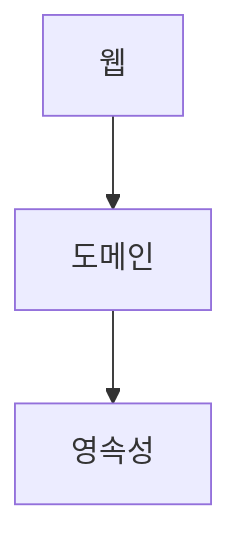
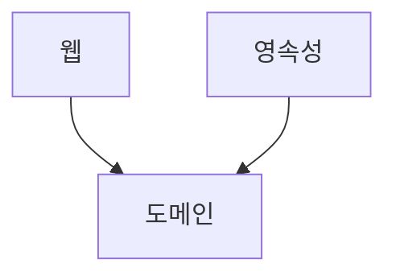
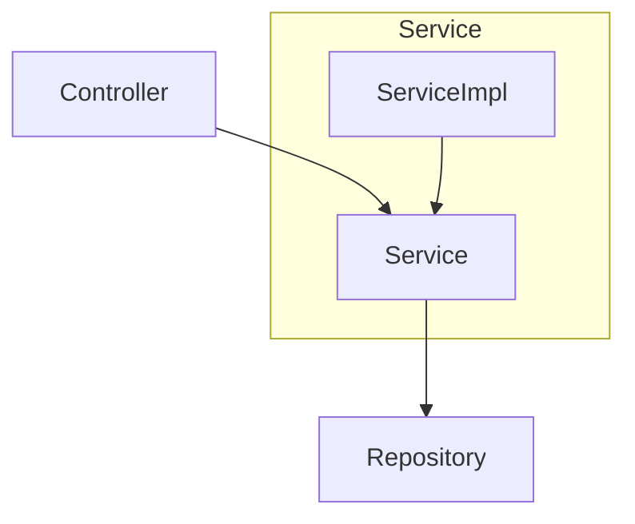
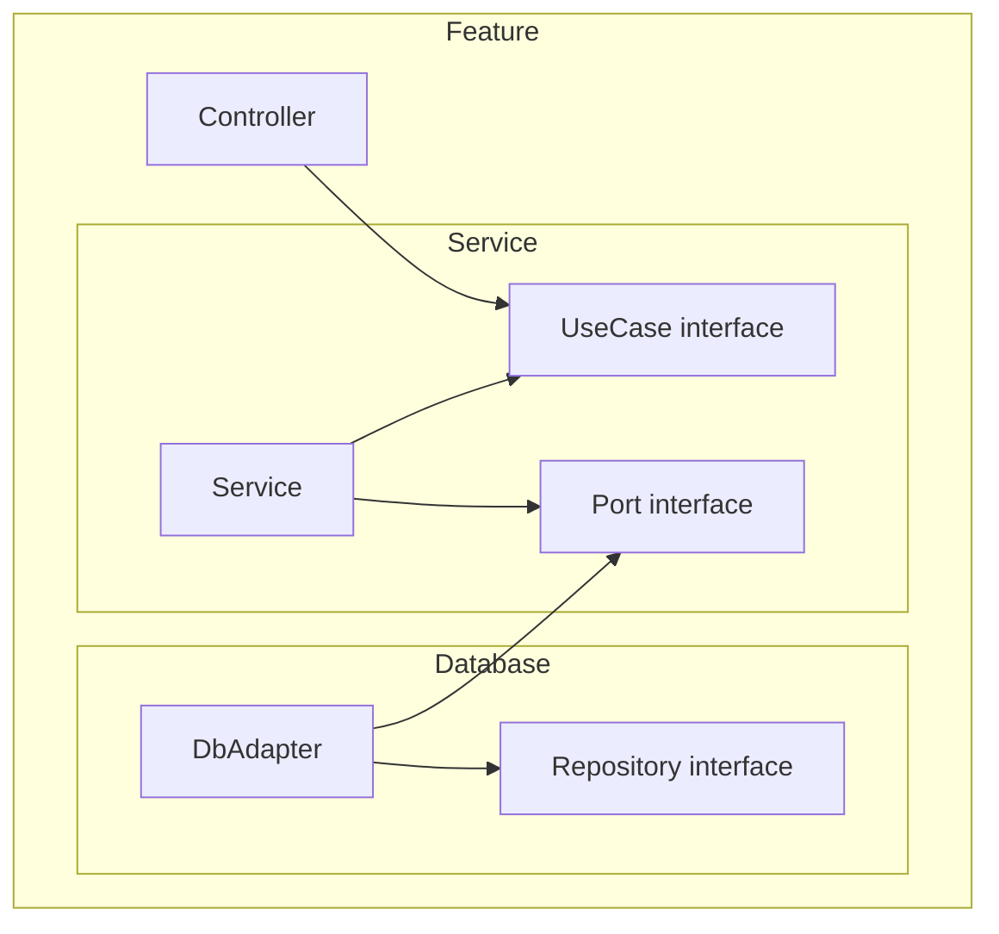

## 소프트웨어 아키텍처가 뭐죠?

소프트웨어가 제공하는 가치에는 크게 기능과 구조가 있다.
보통은 기능에 집중하기 때문에 구조가 왜 가치에 들어가는지 의문을 품을 수 있다.
하지만, Clean Architecture의 저자 Robert C. Martin 은 구조가 더 중요하다고 한다.

보통 코드는 매우 복잡하다. 오랜기간 유지보수를 하면서 오래된 구조위에 쌓았기 때문이다. 프로그램이 초기 개발을 하고나서 유지보수를 하기 때문에 구조가 중요하다. 

>나는 이 말을 **기능**은 클라이언트가 가져가는 가치, **구조**는 개발자가 특히, Back-end 개발자가 가져가는 가치라고 이해했다. 
{: .prompt-tip}

그렇다면 엉클밥(Robert C. Martin)은 좋은 아키텍처에 대해서 뭐라고 했을까?
>***The ultimate Goal of Architecture**
The goal of software architecture is to minimize the lifetime cost (*development cost+ maintenance cost afterwards*) of the software 
-keep software soft
-keep frameworks at arm’s length
-keep options open*

기능이 잘 동작하지만 구조가 엉망인 프로그램은 유지보수가 어렵기때문에 곧 폐기할 프로그램이라고 생각하고, 기능은 아직 없지만 구조가 잘 짜여진 프로그램은 기능을 추가하면 되기 때문에 더 좋은 프로그램이라고 하였다.

<br>
## 좋은 아키텍처를 만드는 방법

코드를 쉽게 파악하고 쉽게 변경할 수 있게 돕는 규칙은 다음과 같다.

 - 패러다임 설계원칙
 - (SOLID) 원칙
 - 컴포넌트 응집성 원칙 
 - 컴포넌트 결합 원칙

>이것들이 다음 포스팅의 주제가 될 것이다.
{: .prompt-tip}

<br>
## 쉬운방법은 없나요?

### 아키텍처 패턴
아키텍처 패턴에는 다음과 같은 것들이 있다.
- 계층형 아키텍처
- 클린아키텍처
- 헥사고날 아키텍처

이외에도 많은 아키텍처가 있다. 그렇다면 이러한 아키텍처를 가지고 어떻게 해봐야 할까?

1. 일단은 패턴을 따라해보기
2. 원칙을 학습하고 이해한 후에 다시 패턴대로 따라해보기
3. 각자의 프로젝트에 레시피를 적용해 보기
4. 고민이 되는 지점들은 원칙에 맞게 타협하며 적용해보기

<br>
## 어떤 아키텍처 패턴을 써야하나요?

### 계층형 아키텍처


장점
- 전통적인 수평적 계층화
- 구조가 단순하고 처음 시작할때 적합함

단점
- 업무 도메인에 대해 아무것도 말해주지 않음
- 소프트웨어가 커지고 복잡해지면 조직화에 도움이 되지 않음
- **데이터베이스 주도 설계 유도**


### 클린 아키텍처

특징
- 도메인이 중심(**의존성 역전**을 이용)

장점
- 규칙이 단순하다
- 도메인이 세부사항에 의존하지 않는다
- **DDD(도메인 주도설계)** 적용이 용이하다
- 비즈니스 규칙에 집중하기 쉽다.

단점

- 패키지 구조가 계층형 보다 복잡하다.
- 레퍼런스가 적다.

<br>
## Clean Architecture를 공부하는 방법
- 클린 아키텍처  Clean Architecture (Robert C. Martin)
- 만들면서 배우는 클린 아키텍처  Get Your Hands Dirty on Clean Architecture (Tom hombergs)

### 잘모르겠으면 헥사고날 아키텍처
클린아키텍처 기본 다이어그램과 가장 비슷하다.
따라할 수 있는 쿡북이나 레퍼런스가 가장 많음


<br>
## 아키텍처별 패키지/클래스 구조 비교

이러한 구조를 가진다고 할 때, 각각의 아키텍처별로 어떤 패키지 구조를 가지는지에 대해 알아보자.

### 계층형 아키텍처
Controller, Service, Repository 패키지를 만들고 그 안에 각각의 계층을 모아둔다. 다음과 같은 패키지 구조이다.
>Controller > CompanyController, TeamController ...  
Service > CompanyService, TeamService ...  
Repository > CompanyRepository, TeamRepository ...

### 기능기반 패키지
각각의 기능별로 Controller, Service, ServiceImpl, Repository를 모아둔다.  다음과 같은 패키지 구조이다.
>  Company > CompanyController, CompanyService...  
Team > TeamController, TeamService ...  
Member > MemberController, MemberService ...

장점
- 코드의 상위 수준 구조가 업무도메인에 대해 무언가를 알려줌
- 유스케이스가 변경될 경우 변경해야할 코드를 모두 찾는 작업이 더 쉬워짐

단점
- 계층 구조가 분리되지 않음

### 헥사고날 아키텍처(포트와 어댑터)
패키지를 더 쪼개서 수직, 수평으로 나누는 방식
DB계층에 대한 의존성을 역전 시킴



장점
- 도메인이 다른 세부사항에 의존하지 않음
- 수직, 수평형 계층구조의 장점을 모두 가짐

단점
- 클래스, 패키지가 많아진다.

<br>
##  클린 아키텍처는 애매하다
클린아키텍처는 핵심 원칙이 2가지 정도이기때문에 애매하다.

### JPA Entity와 Domain Entity, 분리해야하나요?
> *분리했을때 얻는 이득이 크다. 
영속성계층과 도메인계층 강결합이 되기 때문에 클린아키텍처가 아니게된다.*
{: .prompt-info}

### JPARepository는 출력포트가 아니라 어댑터
> *출력포트는 유스케이스가 필요로 하는 형태대로 유지되어야한다. 유스케이스가 DB의 세부사항에 의해 바뀌어야한다면 클린아키텍쳐가 아니다.*
{: .prompt-info}

### 유스케이스가 다른 유스케이스를 호출 할때?
>*컴포넌트를 별도 코드베이스로 분리하려는게 아니라면 직접 호출*
{: .prompt-info}

직접 호출해도 의존성 규칙에 위배되지 않는다. 별도 코드베이스로 분리려면 ```포트```를 통해서 노출,  호출하도록 변경

### 유스케이스를 꼭 인터페이스로 뽑아야하나?
> *인터페이스로 뽑아야 한다.*
{: .prompt-info}

Controller가 Service의 구현에 대해 너무 많이 알지못하도록 막기위해 존재한다. 사고의 경계를 그어주는 역할

<br>
## Reference

- [NHN FORWARD 22] 클린 아키텍처 애매한 부분 정해 드립니다. [https://www.youtube.com/watch?v=g6Tg6_qpIVc](https://www.youtube.com/watch?v=g6Tg6_qpIVc)
- 이미지 출처: [Spring Boot and Hexagonal Architecture](https://reflectoring.io/spring-hexagonal/)


