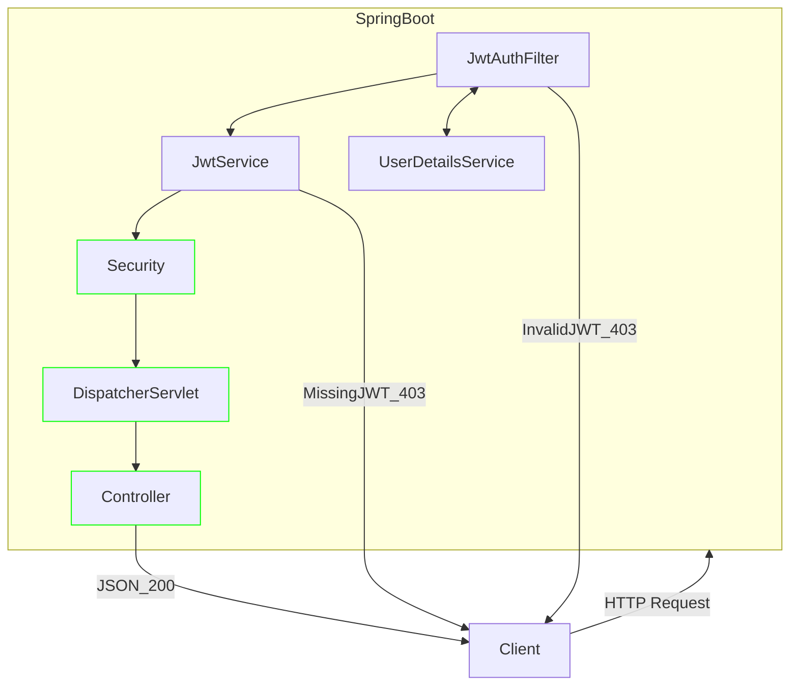

## JWT (JSON Web Token)

### 장점
- 서버의 부담을 크게 덜어줌
- 암호화된 토큰을 사용해 안전한 통신 가능
- 토큰 발행 전용 서버를 개설해 서버의 부담 완화 가능
- 토큰에 특정 권한을 심을 수 있음

### 단점
- 여러 기기에서 로그인 하는 경우 통제 불가
- 토큰 탈취시 무효화 하는 기능이 없음

### 종류
- ```Access Token``` : 사용자 정보에 접근
- ```Refresh Token``` : Access Token 갱신 용도

```Refresh Token```을 서버에 저장하고 ```Access Token```, ```Refresh Token``` 모두를 발급하는 경우, ```Access Token```의 주기를 짧게주고 (몇분 정도), ```Access Token```이 만료되었을때 ```Refresh Token```을 제출하게 되는데, 이때 DB의 값과 대조하여 ```Access Token```을 다시 부여한다. 

### 구조
- ```Header``` : 토큰 타입 지정/ 알고리즘 명시
- ```Payload``` : 토큰에 권한 부여, 사용자 정보를 선택해 담을 수 있다.
- ```Signature``` : 개발자의 암호키가 들어간다.

### 절차
1. 사용자 로그인 요청
2. 서버에서 암호화된 토큰 생성
3. 사용자는 토큰을 저장
4. 이 후 모든 요청에 토큰을 태워 요청함
5. 서버는 토큰을 가지고 사용자 식별


## Architecture



## Reference

- 세션 vs 토큰 vs 쿠키? 기초개념 잡아드림. 10분 순삭[https://www.youtube.com/watch?v=tosLBcAX1vk](https://www.youtube.com/watch?v=tosLBcAX1vk)
- JWT 대충 쓰면 님들 코딩인생 끝남 [https://www.youtube.com/watch?v=XXseiON9CV0](https://www.youtube.com/watch?v=XXseiON9CV0)
- JWT 토큰 사용법 [https://www.youtube.com/watch?v=St8XcfmWqnw](https://www.youtube.com/watch?v=St8XcfmWqnw)