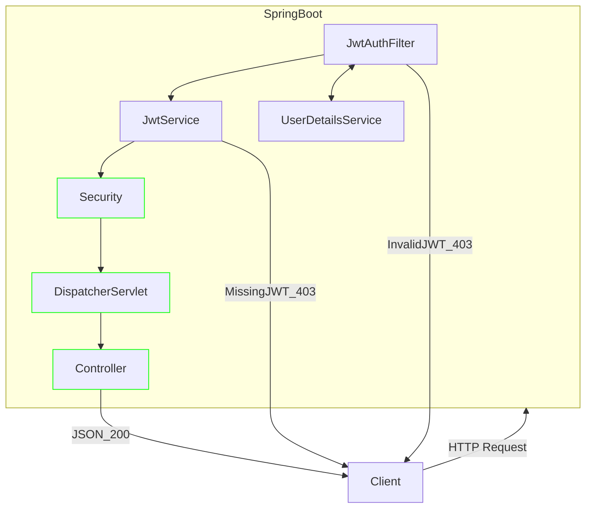

# RestAPI_Practice
Spring Security+JWT Token+RESTAPI

## 개요
- [프로젝트 기간] 2023-09-11 ~ 2023-09-13
- [프로젝트 내용] SpringBoot로 RestAPI 구현하기
- [프로젝트 기여도] 100%
- [프로젝트 링크] [https://github.com/Yeongwookang/RestAPI_Practice.git](https://github.com/Yeongwookang/RestAPI_Practice.git)

## 기술스택
- back-end : ```SpringBoot```
- library: ```JPA```, ```SpringSecurity```, ```jjwt```, ```springdoc```
- DB: ```MySQL```

## 기술을 선정한 이유

### Restful API + JWT 토큰 방식
- 세션을 사용하지 않아도 되서 구현이 단순해짐
- 협업이 편해짐
- RESTful API를 위해서 세션방식을 사용할 수 없었음
- DB 의존적인 구조를 벗어나기 위해



## JWT 을 이용한 인증방식
위의 flowchart를 통해 볼수 있듯이, JwtAuthFilter를 통해 JWT 검사 및 인증, 인가를 할 수 있다.

관련 상세문서를 확인하려면 [[문서](https://yeongwookang.github.io/posts/RestApiJWT/)]

## RESTful API 개발내용
Todo List를 CRUD 해주는 RestfulAPI 개발

관련 상세 문서를 확인 하려면 [[문서](https://yeongwookang.github.io/posts/RestApiJWT/)]

## DB 설계
member Table이 전부이다.

## 협업을 위해 노력한 점
api문서를 swagger-ui 기반으로 남겼다. 

관련 상세 문서를 확인 하려면 [[문서](https://yeongwookang.github.io/posts/RestApiJWT/)]
